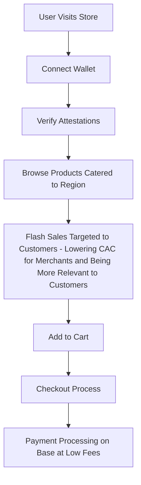

# OnchainKit Store

A Next.js e-commerce application built with OnchainKit, featuring Coinbase Commerce integration and Base attestation verification.

## 🎯 Problem Statement

In today's digital commerce landscape, merchants face several critical challenges:

1. **Rising Customer Acquisition Costs**
   - Digital advertising costs have increased by over 60% in the last five years
   - Traditional targeting methods are becoming less effective due to privacy regulations
   - Cookie deprecation and iOS privacy changes have disrupted conventional marketing channels

2. **Trust and Verification Challenges**
   - Difficulty in verifying customer demographics and eligibility
   - Risk of fraud in promotional campaigns and regional launches
   - Limited ability to offer exclusive deals to verified customer segments

3. **Customer Relationship Building**
   - Lack of reliable mechanisms to reward loyal customers
   - Limited tools for creating verifiable customer segments
   - Challenge in maintaining long-term customer engagement

## 💡 Solution

Our platform revolutionizes e-commerce by leveraging blockchain attestations to create a trustless, efficient marketplace:

### For Merchants
- **Targeted Marketing**: Leverage Base attestations to precisely target verified customer segments
- **Cost Reduction**: Dramatically lower customer acquisition costs by reaching pre-verified audiences
- **Flash Sale Management**: Securely run region-specific flash sales with guaranteed customer verification
- **Fraud Prevention**: Ensure promotions reach only eligible, verified customers
- **Customer Loyalty**: Build stronger relationships through verified customer segments

### For Customers
- **Exclusive Access**: Unlock special products and deals through verifiable attestations
- **Privacy-Preserving**: Prove eligibility without sharing personal data
- **Better Deals**: Access region-specific offers and flash sales
- **Simplified Verification**: One-time verification process for ongoing benefits
- **Trustless Interaction**: No need to trust the merchant with personal information

## 🚀 Market Opportunity

The solution addresses a massive market opportunity in the e-commerce space:

### Growing Market Need
- Global e-commerce market expected to reach $8.1 trillion by 2026
- Customer acquisition costs (CAC) have increased by 222% over the last eight years
- 63% of marketers cite generating traffic and leads as their top challenge

### Competitive Advantages
1. **First-Mover in Attestation-Based E-commerce**
   - Pioneer in leveraging Base attestations for customer verification
   - Unique position in combining blockchain verification with e-commerce
   - Early partnership opportunities with major platforms

2. **Technical Innovation**
   - Built on Base, ensuring scalability and low costs
   - Integration with Coinbase Commerce for seamless payments
   - Extensible architecture for future features

3. **Privacy-First Approach**
   - Aligned with global privacy regulations
   - No storage of personal data
   - Trustless verification system

### Target Market
- **Primary**: E-commerce platforms and merchants
- **Secondary**: Direct-to-consumer (D2C) brands
- **Tertiary**: Loyalty program providers

## 🔄 User Interaction and Data Flow

### 1. Initial User Journey


### 2. Attestation Verification Flow
1. **Connect Wallet**
   - User connects their wallet using OnchainKit's wallet connector
   - System identifies the connected wallet address

2. **Attestation Check**
   - System queries Base Attestation Service for:
     - Region verification (e.g., Canadian residency)
     - Trading access verification
   - Real-time validation of attestation status
   - Unlocks eligible products based on verifications

3. **Product Access**
   - Verified users see their eligible products
   - Special deals and flash sales become available
   - Product cards display verification status
   - Prices adjust based on verification level

### 3. Purchase Flow
1. **Cart Management**
   - Add verified products to cart
   - Quantity adjustments
   - Cart persistence across sessions

2. **Payment Processing**
   - Seamless integration with Coinbase Commerce
   - Support for multiple payment methods
   - Real-time transaction status updates
   - Automatic order creation upon payment

### 4. Data Security
- No personal data stored on-chain
- Attestations verify eligibility without exposing details
- Encrypted payment processing
- Wallet connection through secure protocols

### 5. Error Handling
- Clear feedback for verification failures
- Graceful handling of network issues
- Guided resolution for payment errors
- Support for transaction retry

## 📸 Visual Documentation

### Initial Store View With No Verification

*Homepage showing the product catalog before verification

### Wallet Connection & Verification

*Customer connects wallet and verifies attestion - protecting privacy and only revealing region and trading access

### Attestation Verification

*Verification status check for region and trading access*

### Product Display

*Product cards showing verification status and pricing as examples of more products relevant to customer to encourage verification*

### Shopping Cart

*Shopping cart with verified products*

### Extremely Low Fees for Payments using Stablecoins / Crypto

*Coinbase Commerce checkout integration*

### Payout to Merchants


*Payout to Merchants through Coinbase Wallet*


## Features

- Faciitates flash sales by targeting verified Canadian users through Base attestations
- Gates products based on verifications for trading and region
- Successfullly implement payment processing through Coinbase Commerce and payout through Coinbase Wallet
- Coinbase Commerce integration
- Base attestation verification
- Wallet connection
- Test mode for development

https://base.easscan.org/attestation/view/0xd323f38fc39e6dfc9e9a01f05e544f3829c5c1c01fb6273353ea59c682e00a7d

https://base.easscan.org/attestation/view/0xa76f5d6269e956f535eb3c295889075a08c740dfc54ee7378390cff58e0a9a26

## Technologies & SDKs

### OnchainKit Integration
- **@coinbase/onchainkit**: Comprehensive SDK for building onchain applications
- Features used:
  - Identity components for ENS/Base name resolution
  - Wallet connection components
  - Frame components for social integration
  - Transaction handling utilities

### Base Network Integration
- **Base Attestation Service**:
  - Uses `@ethereum-attestation-service/eas-sdk` for attestation verification
  - Verifies user region and trading access attestations
  - Implements schema-based attestation validation
  - Handles attestation UIDs and data decoding

### Coinbase Commerce
- **Coinbase Commerce API Integration**:
  - Direct API integration for payment processing
  - Handles both NFT and physical product sales
  - Supports test mode for development
  - Implements webhook handling for order status updates
  - Manages charge creation and verification

### Web3 Integration
- **wagmi**: Ethereum hooks library
  - Wallet connection management
  - Chain management
  - Transaction handling
- **viem**: Low-level Ethereum interaction
  - Contract interactions
  - RPC provider management
  - Transaction building

### Frontend Framework
- **Next.js 14**
  - App Router for routing
  - Server Components for improved performance
  - API Routes for backend functionality
- **React 18**
  - Hooks for state management
  - Context for global state
  - Server and Client Components

### UI Components
- **@headlessui/react**: Accessible UI components
- **@heroicons/react**: Icon set
- **Tailwind CSS**: Utility-first CSS framework

### Development Tools
- **TypeScript**: Type safety and developer experience
- **ESLint**: Code quality and consistency
- **PostCSS**: CSS processing

## Environment Variables

Copy `.env.example` to `.env.local` and fill in your values:

```bash

# OnchainKit API Key
NEXT_PUBLIC_ONCHAINKIT_API_KEY=your_api_key_here

# Coinbase Commerce API
NEXT_PUBLIC_COINBASE_COMMERCE_API_KEY=your_api_key_here

# Base Network RPC URL (for attestations)
You can get your own custom RPC from Base as well on CDP for Developer Tools at portal.cdp.coinbase.com under node
NEXT_PUBLIC_BASE_RPC_URL=https://mainnet.base.org
```

## Base Attestation Integration

The project uses Base Attestations for user verification:

1. **Region Attestation**:
   - Verifies user's region eligibility
   - Decodes region data from attestation

2. **Trading Access**:
   - Verifies user's trading permissions
   - Handles multiple attestation types
   - Implements proper error handling

## Coinbase Commerce Integration

Payment processing is handled through Coinbase Commerce:

1. **Test Mode**:
   - Physical items: $0.10 USD each
   - Simplified testing flow

2. **Production Mode**:
   - Full price implementation
   - Secure payment processing

## Development

```bash
# Install dependencies
npm install

# Run development server
npm run dev
```

## Deployment

1. Push code to GitHub
2. Import project in Vercel
3. Configure environment variables in Vercel dashboard
4. Deploy!

## Testing

Use test mode for development:
- Physical items: $0.10 USD each

## Production

Regular pricing applies in production mode.

## Architecture

The project follows a modular architecture:

```
app/
├── components/         # React components
│   ├── cart/          # Cart-related components
│   ├── product/       # Product-related components
│   └── checkout/      # Checkout components
├── utils/             # Utility functions
│   ├── coinbase.ts    # Coinbase Commerce integration
│   └── attestation.ts # Base attestation handling
├── hooks/             # Custom React hooks
└── types/             # TypeScript type definitions
```
